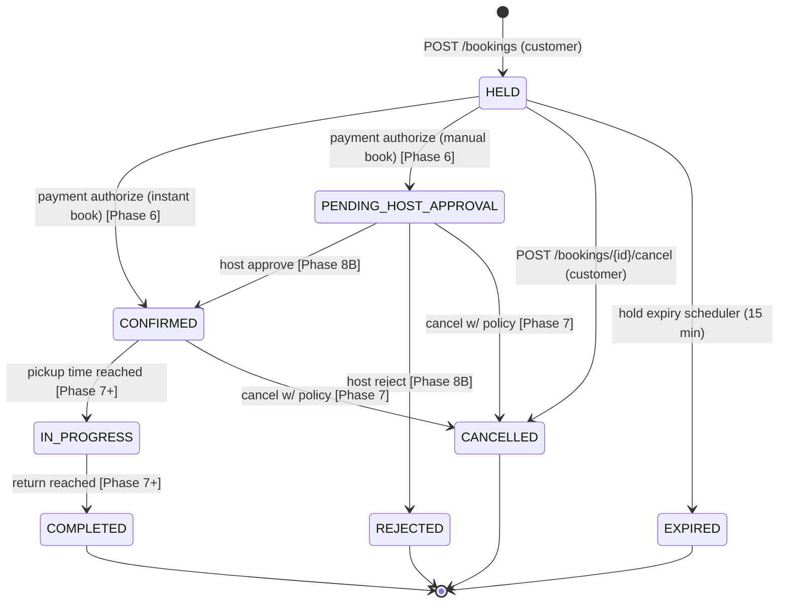

# Booking Flow — Frontend Specification

> **Status**: Historical / planning snapshot. Tài liệu này phản ánh giai đoạn FE static-to-wire cũ và không còn là source-of-truth current-state. Dùng để tham khảo quyết định lịch sử; hành vi hiện tại phải đối chiếu với code trong `frontend/src/features/bookings/*`, `frontend/src/features/listings/*`, và `docs/roadmap.md`.
>
> **Nguồn sự thật BE**:
> - `src/main/java/com/rentflow/booking/controller/BookingController.java`
> - `src/main/java/com/rentflow/booking/service/BookingService.java`
> - `docs/error-codes.md`, `docs/phase-05-booking-core-executable-spec.md`
>
> **Nguồn tham chiếu FE thời điểm tài liệu được viết**:
> - `frontend/src/features/bookings/*.tsx`, `frontend/src/features/bookings/types.ts`
> - `frontend/src/mocks/bookings.ts`, `frontend/src/mocks/listings.ts`
> - `frontend/src/lib/api-client.ts`, `frontend/src/lib/idempotency.ts`, `frontend/src/lib/server/backend.ts`

---

## 1.1 Booking state machine



**Phase 5 actually implements**: tạo `HELD`, cancel `HELD`, expire `HELD` (background scheduler, `SKIP LOCKED`), PATCH location ở `HELD/PENDING_HOST_APPROVAL/CONFIRMED` (`BookingService.java:55-58`).

**Current backend reality**: backend hiện đã support cancel `PENDING_HOST_APPROVAL` và `CONFIRMED` với void/capture/policy/retry behavior; tài liệu phase cũ trong repo có thể vẫn mô tả đó là Phase 7.

**Current frontend reality**: booking detail UI hiện đã expose cancel cho `HELD`, `PENDING_HOST_APPROVAL`, và `CONFIRMED` trước pickup. Frontend chỉ gate coarse theo `pickupDate`; backend vẫn là authority cuối cùng cho `BOOKING_INVALID_STATUS`.

---

## 1.2 Screen graph

```
[/]  hoặc  [/listings]
  │
  └──> [/listings/:id]                                     ← chi tiết xe
         │
         ├─ guest        → [/login?next=/listings/:id/book]
         └─ customer     → [/listings/:id/book]            ← form HELD
                            │
                            └─ submit ok → [/bookings/:id] ← banner + countdown
                                            │
                                            ├─ "Edit locations" (HELD|PENDING|CONFIRMED) → PATCH → refetch
                                            ├─ "Cancel"        (`HELD`, `PENDING_HOST_APPROVAL`, `CONFIRMED` trước pickup) → modal → POST cancel
                                            ├─ countdown=0                                 → refetch ⇒ EXPIRED
                                            └─ "Pay now"       [Phase 6 — disabled w/ tooltip]
                                            
[/me/bookings]                                              ← list, filter status
  └─ row click → [/bookings/:id]
```

### Per-screen spec

#### `/listings/:id/book` — Create booking
| Field | Value |
|-------|-------|
| FE file | `frontend/src/features/bookings/booking-create-page-view.tsx` |
| Data nguồn (Sprint 2-wire) | `GET /api/listings/:id` (BFF — chưa có, Phase 3 sẽ thêm) để hiển thị listing; submit → `POST /api/bookings` |
| Auth | customer (RoleGuard); guest banner hiện CTA login với `?next=` |
| Entry params | `:id` = listingId UUID; query `?guest=1` (legacy demo) |
| Form fields | `pickupDate`, `returnDate`, `pickupLocation`, `returnLocation`, `selectedExtraIds[]` |
| Client validation | pickup ≥ today, return > pickup, ≤ 30 ngày |
| Idempotency | UUID v4 sinh client-side lúc submit, lưu trong React state cho đến khi response ≠ network error; retry dùng cùng key |
| Submit success | redirect `/bookings/:id` (booking vừa tạo, status `HELD`) |
| Exit | back → `/listings/:id` |

#### `/bookings/:id` — Booking detail
| Field | Value |
|-------|-------|
| FE file | `frontend/src/features/bookings/booking-detail-page-view.tsx` |
| Data nguồn | `GET /api/bookings/:id` |
| Auth | customer owner (BE check); FE wrap RoleGuard customer |
| Actions theo status | xem bảng dưới |
| Auto behavior | nếu `status=HELD` và `holdExpiresAt` ≤ now → refetch ngay; sau refetch `status=EXPIRED` → ẩn action |

| Status                 | Edit locations | Cancel | Pay now             |
|------------------------|:--------------:|:------:|:-------------------:|
| HELD                   |       ✅       |   ✅   | disabled + tooltip  |
| PENDING_HOST_APPROVAL  |       ✅       | ✅ | ❌ |
| CONFIRMED              |       ✅       | ✅ trước pickup; sau pickup disabled và backend vẫn là authority cuối cùng | ❌ |
| IN_PROGRESS            |       ❌       |   ❌   | ❌                  |
| COMPLETED              |       ❌       |   ❌   | ❌                  |
| CANCELLED / REJECTED / EXPIRED | ❌     |   ❌   | ❌                  |

> **Historical note**: copy được chốt ở thời điểm tài liệu này viết đã cũ. Wording current-state phải theo code hiện tại, không theo placeholder payment tooltip trong doc này.

#### `/me/bookings` — My bookings list
| Field | Value |
|-------|-------|
| FE file | `frontend/src/features/bookings/bookings-list-page-view.tsx` |
| Data nguồn | `GET /api/bookings/me?status=...&page=...&size=...` |
| Auth | customer |
| Filter | `status` ∈ {ALL, HELD, PENDING_HOST_APPROVAL, CONFIRMED, IN_PROGRESS, COMPLETED, CANCELLED, REJECTED, EXPIRED}; `ALL` ⇒ không gửi query |
| Pagination | offset paging; mặc định `page=0&size=20`, sort `createdAt DESC` (đã default phía BE) |
| Row click | `/bookings/:id` |

---

## 1.3 Direct call contract

> **Quyết định bổ sung 2026-05-20**: Bỏ BFF cho booking. FE gọi thẳng backend qua `api-client.ts`. Lý do: `next.config.ts` đã có rewrite `/api/v1/*` → backend (Sprint 1); `api-client.ts` đã forward Authorization + `Idempotency-Key` + handle 401 refresh. BFF cho booking sẽ là pass-through rỗng vì không có cookie work như auth. Pattern: **BFF chỉ cho cookie work (auth); data calls đi direct.**

### Pattern

- `frontend/src/lib/api-client.ts` exports `api.get/post/patch/delete` với options `{ idempotencyKey, headers, skipAuth, skipRefresh }`.
- `frontend/src/lib/idempotency.ts` cung cấp `useIdempotencyKey()` (UUID v4, hold trong ref per form) và `newIdempotencyKey()` (sinh ad-hoc).
- Browser fetch → `/api/v1/bookings/...` → `next.config.ts` rewrite → Spring `BookingController`.

**Resolved utility note**: `api-client.ts` now generates `X-Correlation-Id` for outgoing `/api/v1` calls when callers do not provide one. Backend `CorrelationIdFilter` still generates and echoes a correlation id for external clients that omit it.

### Endpoint map

| Client call                                                       | Backend                              | Idempotency-Key | Body                                                                            | 2xx body                          |
|-------------------------------------------------------------------|--------------------------------------|:--------------:|----------------------------------------------------------------------------------|-----------------------------------|
| `api.post("/bookings", body, { idempotencyKey })`                 | `POST /api/v1/bookings`              | ✅ required    | `{ listingId, pickupDate, returnDate, pickupLocation?, returnLocation?, extras: [{extraId, quantity}] }` | `BookingResponse` (201)           |
| `api.get("/bookings/me?status=&page=&size=")`                     | `GET /api/v1/bookings/me`            | —              | query: `status?`, `page=0`, `size=20`                                            | `PageResponse<BookingSummaryResponse>` |
| `api.get("/bookings/{id}")`                                       | `GET /api/v1/bookings/{id}`          | —              | —                                                                                | `BookingResponse`                 |
| `api.patch("/bookings/{id}", body)`                               | `PATCH /api/v1/bookings/{id}`        | —              | `{ pickupLocation?, returnLocation? }` (≥1 field non-null)                       | `BookingResponse`                 |
| `api.post("/bookings/{id}/cancel", body, { idempotencyKey })`     | `POST /api/v1/bookings/{id}/cancel`  | ✅ required    | `{ reason?: string }`                                                            | `CancelBookingResponse`           |

### Payload shape BE (đối chiếu thực tế)

`CreateBookingRequest` (record):
```
listingId: UUID
pickupDate: LocalDate     (ISO "yyyy-MM-dd")
returnDate: LocalDate
pickupLocation: String?
returnLocation: String?
extras: List<{ extraId: UUID, quantity: int }>
```

`BookingResponse` (record): `id, status, listingId, listingTitle, customerId, hostId, pickupDate, returnDate, pickupLocation, returnLocation, holdExpiresAt (Instant), totalAmount (BigDecimal), currency (String), priceSnapshot (JsonNode), policySnapshot (JsonNode), createdAt (Instant)`.

### Idempotency-Key rules

- Format: UUID v4 (BE regex `BookingController.java:40-41`).
- FE sinh 1 lần per form-submission attempt (lưu vào `useRef` hoặc state). Retry network error → cùng key. User edit form rồi submit lại → key mới.
- BE behavior:
  - Same key + same hash body → replay cached response (200/201 cùng dữ liệu).
  - Same key + different hash → 409 `IDEMPOTENCY_KEY_CONFLICT`.
  - Same key đang process → 409 `REQUEST_ALREADY_PROCESSING`.

---

## 1.4 Role gating (FE)

| Route | Role required | Guest handling |
|-------|--------------|----------------|
| `/listings/:id/book` | CUSTOMER | redirect `/login?next=/listings/:id/book` |
| `/me/bookings` | CUSTOMER | redirect `/login?next=/me/bookings` |
| `/bookings/:id` | CUSTOMER (BE check ownership) | redirect `/login?next=/bookings/:id` |

- Implement bằng `RoleGuard` (`frontend/src/features/auth/role-guard.tsx`, Sprint 1).
- `next` param phải qua sanitization của Sprint 1 (chỉ chấp nhận path bắt đầu `/`, không `//`).
- Host/Admin view bookings → **out of scope** Sprint 2-wire, sẽ ở `/host/bookings/...` sprint sau.

---

## 1.5 Error / edge UX

Mapping codes (theo `docs/error-codes.md` + handler thực tế):

| Tình huống                             | HTTP | Code BE                       | UI FE                                                        |
|----------------------------------------|:----:|-------------------------------|--------------------------------------------------------------|
| Idempotency replay (cùng key, cùng body) | 201/200 | (success, từ cache)        | Hiển thị booking trong response, KHÔNG tạo mới, redirect detail |
| Idempotency-Key thiếu                  | 400  | `IDEMPOTENCY_KEY_REQUIRED`    | Internal — BFF tự xử lý (luôn forward); nếu xảy ra → toast lỗi hệ thống |
| Idempotency-Key conflict (body khác)   | 409  | `IDEMPOTENCY_KEY_CONFLICT`    | Toast "Yêu cầu đã thay đổi, vui lòng submit lại"; regenerate key |
| Request đang process                   | 409  | `REQUEST_ALREADY_PROCESSING`  | Spinner + auto-retry sau 1.5s (tối đa 2 lần)                  |
| Listing không khả dụng (overlap dates) | 409  | `LISTING_NOT_AVAILABLE`       | Banner đỏ trên form, gợi ý đổi ngày                          |
| Customer đã có booking overlap         | 409  | `BOOKING_OVERLAP_CUSTOMER`    | Banner đỏ + link đến `/me/bookings`                           |
| Status/time window không hợp lệ cho cancel | 409  | `BOOKING_INVALID_STATUS`   | Toast + refetch detail (UI tự sync state mới)                |
| Cancel accepted nhưng void cần retry   | 202  | `PAYMENT_VOID_RETRY_REQUIRED` | Show accepted-state banner; booking đã cancel, payment void sẽ retry nền |
| Driver chưa verify                     | 403  | `DRIVER_LICENSE_NOT_APPROVED` | Redirect `/me/profile` kèm toast (Phase 8A; Sprint 2-wire chỉ cần hiển thị message vì flag `require-driver-verification=false` mặc định) |
| Access denied (không phải owner)       | 403  | `ACCESS_DENIED`               | Redirect `/forbidden`                                         |
| Booking không tồn tại                  | 404  | `LISTING_NOT_FOUND` / 404 chung | Empty state "Booking not found" (đã có ở mock) + link list |
| Auth expired                           | 401  | `AUTH_TOKEN_EXPIRED`          | BFF refresh + retry 1 lần; thất bại → logout + redirect login |
| Validation                             | 400  | `VALIDATION_ERROR`            | Inline field error theo `details[].field`                    |
| Rate limit                             | 429  | `TOO_MANY_REQUESTS`           | Toast "Quá nhiều yêu cầu" + disable submit 10s (Phase 8B sẽ thêm Retry-After header) |
| 5xx                                    | 500  | `INTERNAL_ERROR`              | Error banner (`api-error-panel.tsx`) + correlationId         |
| Timer=0 nhưng BE chưa expire           | 200  | (success, status=HELD)        | Retry refetch 3× × 5s (window 15s); sau 3 lần vẫn HELD → toast "Hold đang được xử lý, refresh trang" |

### Edge timing — hold expiry

- Trên `/bookings/:id` với `status=HELD`: `HoldCountdown` chạy local timer dựa trên `holdExpiresAt`.
- Khi timer chạm 0 → component bắn callback → page **refetch** `GET /api/bookings/:id` 1 lần.
- Nếu BE đã chuyển `EXPIRED` (scheduler đã chạy) → render badge `EXPIRED`, ẩn mọi action.
- Nếu BE chưa expire (scheduler delay) → countdown hiển thị "Đang xác nhận..." + retry refetch 3× × 5s (window 15s). Sau 3 lần vẫn `HELD` → toast `"Hold đang được xử lý, refresh trang"` và **dừng retry** (tránh infinite loop). Edge case này hiếm vì scheduler chạy phút-level.

---

## 1.6 Decisions (đã chốt 2026-05-20)

Tất cả 6 đề xuất đã được user duyệt với refinement chi tiết. Đây là input ràng buộc cho Sprint 2-wire.

### 1. Customer cross-listing overlap → Server-authoritative

Chỉ xử lý 409 sau submit, **không pre-check**. Lý do: client check trước submit sẽ duplicate logic BE và stale ngay khi user mở 2 tab; server là single source of truth.

**UX bù lại**: form submit 409 `BOOKING_OVERLAP_CUSTOMER` → banner đỏ kèm link `"Xem các booking đang active của bạn → /me/bookings"` để user tự đối chiếu. Không pre-fetch warning.

### 2. Extras quantity → Default quantity=1, backlog quantity-picker

**Implementation note**: FE map `selectedExtraIds: string[]` → `extras: RequestedExtra[]` **ngay tại request builder** (BFF call site), **không đổi state shape của form**. Khi sprint sau thêm quantity-picker chỉ cần đổi state thành `Record<extraId, number>` mà không phá BFF contract.

**Backlog item**: "Booking extras quantity-picker UI" — priority sau Phase 6 payment.

### 3. Hold-expire client behavior → Refetch 1× + retry 3× × 5s

Lý do: BE expire qua scheduler nên có thể chậm vài giây so với client countdown. Nếu refetch 1 lần thấy vẫn HELD → user confuse. Retry 3× × 5s = window 15s, đủ cho scheduler chạy.

**Sau 3 lần vẫn HELD** → toast `"Hold đang được xử lý, refresh trang"` và dừng retry (tránh infinite loop). Đã thêm vào mục 1.5.

### 4. "Pay now" → Disabled + tooltip

**Exact copy**:
- button text: `"Pay now"`
- state: `disabled`
- tooltip: historical payment-placeholder copy at the time this document was written

Lý do: ẩn hoàn toàn → user CONFIRMED thấy không có action gì nữa, sẽ hỏi support. Disabled + tooltip set expectation rõ và giảm support load.

### 5. Edit locations PATCH → Toast + refetch detail in-place

Reload toàn trang sẽ mất scroll position và countdown timer state. Toast success (`"Đã cập nhật địa điểm"`) + refetch detail là pattern chuẩn của Sprint 1 (xem account settings PATCH flow).

**Implementation note**: refetch chỉ booking detail query, **không refetch listing/user**.

### 6. Host/Admin view → Out-of-scope Sprint 2-wire

Confirm OK. Tách thành plan riêng:

- **Sprint 3 — Host bookings dashboard** (mở plan ngay sau Sprint 2-wire):
  - `/host/bookings` — list booking của các listing host sở hữu
  - `/host/bookings/:id` — detail + actions approve/reject cho `PENDING_HOST_APPROVAL`
- **Sprint 4+ — Admin booking view** — tách thành plan riêng.

Đã đưa vào "Out of scope" + backlog bên dưới để không bị rớt.

---

## 1.7 Known divergence FE ↔ BE (cần fix khi wire)

| Item | FE hiện tại | BE thực tế | Cách xử lý ở Sprint 2-wire |
|------|-------------|------------|---------------------------|
| `currency` type | union `"VND"` (cứng) | `String` | Nới FE type thành `string`; vẫn render VND |
| Extras | `selectedExtraIds: string[]` | `List<RequestedExtra>{extraId, quantity}` | Mapper: `id => {extraId: id, quantity: 1}` |
| `totalAmount` | `number` | `BigDecimal` (JSON string hoặc number tùy Jackson config) | Confirm Jackson config; nếu là string → parse trên BFF |
| `holdExpiresAt` | `string` (ISO) | `Instant` (ISO timestamp) | OK, không cần fix |
| `priceSnapshot`, `policySnapshot` | typed object | `JsonNode` (free-form JSON) | FE giữ shape hiện tại; BFF chỉ pass-through; thêm runtime guard nếu shape thay đổi |
| `customerId` / `hostId` | không có ở `BookingSummaryViewModel` | có trong `BookingResponse` | Thêm vào FE type để dùng cho ownership check / tương lai host view |
| BFF routes `/api/bookings/*` | Đề xuất ban đầu | Không cần — `next.config.ts` rewrite + `api-client.ts` đã cover | **Bỏ BFF cho booking**. Xem mục 1.3. |

---

## Verification checklist

- [ ] Mermaid diagram render OK trên GitHub.
- [x] 6 quyết định ở mục 1.6 đã chốt (2026-05-20).
- [ ] Spec đối chiếu code BE hiện tại không phát sinh divergence mới (chỉ 6 item ở mục 1.7).
- [ ] Sprint 2-wire mở plan riêng, tham chiếu file này.

## Out of scope (đẩy plan/sprint riêng)

- Implement BFF routes / replace mocks → historical sprint planning item.
- Listings + search FE wiring (Phase 3/4) → plan riêng; phải xong trước E2E flow.
- **Sprint 3 — Host bookings dashboard**: `/host/bookings`, `/host/bookings/:id` (approve/reject `PENDING_HOST_APPROVAL`).
- **Sprint 4+ — Admin booking view** — plan riêng.
- Payment UI (Phase 6).
- Driver verification UI (Phase 8A).
- **X-Correlation-Id outgoing** trong `api-client.ts` — resolved by the shared API client generating the header when missing.

## Backlog (track riêng, kế thừa từ mục 1.6)

- [ ] **Booking extras quantity-picker UI** — sau Phase 6 payment. Đổi form state `selectedExtraIds: string[]` → `Record<extraId, number>`; BFF contract giữ nguyên.
- [ ] **Sprint 3 — Host bookings dashboard** (đã liệt kê ở Out of scope).
- [ ] **Sprint 4+ — Admin booking view**.
